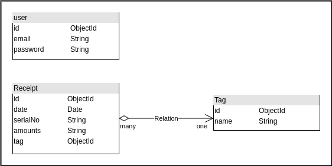

# README

## Tech

- Typescript
- Express
- MongoDB
- Docker

## Run the server

### script command

**Start**

```
yanr start
```

**Build**

```
yanr buile
```

### docker-compose

**Start**

```
docker-compose up -d
```

**Stop**

```
docker-compose down
```

### Run with script (recommend)

Recommend run the script to start the server.

```
bash ./scripts/restart-docker-compose.sh
```

## Demo

The demo server ip: [13.115.54.116:3000](http://13.115.54.116:3000)

receipt sample: [./sampleFile](./sampleFile)

## API Document

Refer to [receipt_collection.postman_collection.json](./receipt_collection.postman_collection.json)

## E-R Model Diagram

### E-R Model Diagram



### Receipt schema columns explanation

| schema columns | receipt data                           |
| -------------- | -------------------------------------- |
| store          | fist line                              |
| tel            | Tel                                    |
| gstRge         | GST Reg.                               |
| date           | Date, Time                             |
| serialNo       | Receipt ID                             |
| details        | Between `+-----+` line and empty line  |
| payment        | Before subTotal                        |
| subTotal       | subTotal                               |
| tender         | TENDER                                 |
| change         | CHANGE                                 |
| qty            | QTY                                    |
| total          | Total                                  |
| inclusive      | INCLUSIVE                              |
| gst            | GST                                    |
| tag            | Not in receipt data. Filled in by user |

```
            store -----> Bob's Store
              tel -----> Tel :0123456789
           gstReg -----> GST Reg.:0123456789

             date -----> Date:14.04.2020  Time:19:51:46
         serialNo -----> Receipt ID:92737
(+---+ Line)       +---> +----------------------------------------------+
                   |     88823027 Viceroy Menthol Super
          details -+     3 x 11.70                                  35.10
                   |     7622210410474 Cadbury Dairy Milk 165g
                   |     2 x 3.80                                    7.60
(empty Line)       +--->
payment, subTotal -----> CASH          SubTotal:                    42.70
    tender,change -----> TENDER 50.00   CHANGE 7.30
              qty -----> ITEMS(2)  QTY(5)
                         ------------------------
            total -----> Total :            42.70
                         ------------------------
   inclusive, gst -----> INCLUSIVE 7% GST 2.79
                         --- Thank You & Have A Nice Day ---

```
